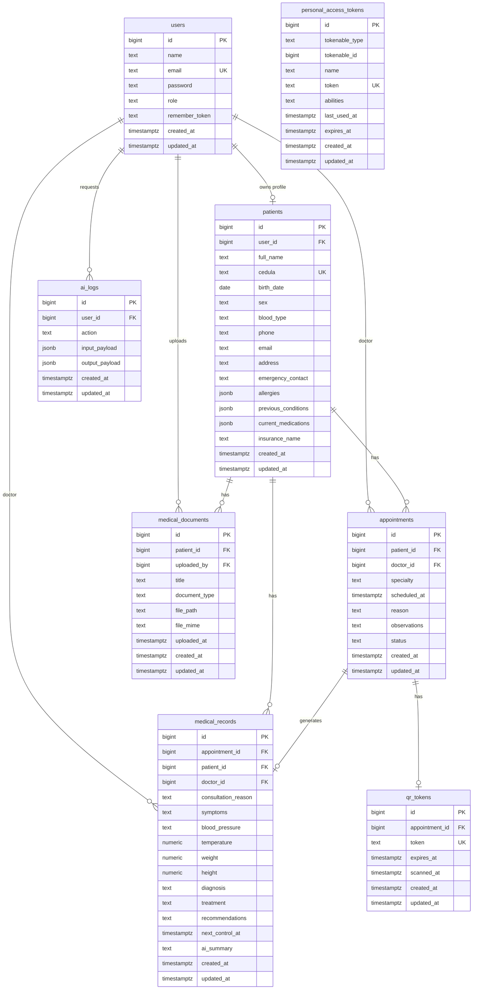

# RegistroMedico Entity Relationship

## Relaciones

- `users` contiene usuarios de la app con roles: `patient`, `doctor`, `receptionist`, `admin`.
- `patients.user_id` vincula opcionalmente un paciente con su usuario de acceso.
- `appointments.patient_id` vincula cada cita a un paciente.
- `appointments.doctor_id` vincula opcionalmente la cita al doctor en `users`.
- `medical_records` vincula consulta médica con cita, paciente y doctor.
- `medical_documents` almacena documentos del paciente y el usuario que los subió.
- `qr_tokens` mantiene un token único por cita para acceso/escaneo.
- `ai_logs` registra acciones de IA por usuario opcional.
- `personal_access_tokens` mantiene compatibilidad con Laravel Sanctum.
